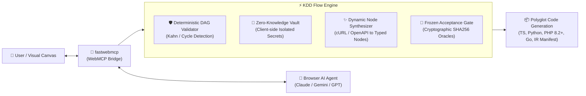

# KDD Flow Engine ⚡

[](https://github.com/MauricioPerera/kdd-flow-engine/actions/workflows/deploy-pages.yml)
[](https://mauricioperera.github.io/kdd-flow-engine/)
[](https://opensource.org/licenses/MIT)
[](https://www.typescriptlang.org/)
[](https://github.com/MauricioPerera/fastwebmcp)
[](https://github.com/MauricioPerera/KDD)
[](#-multilingual-support-i18n)

> **AI-First Automation & Workflow Orchestration Engine** with deterministic **KDD Governance**, in-browser agent tools via **fastwebmcp (WebMCP)**, **Dynamic On-the-fly API Synthesis**, a **Zero-Knowledge Local Credential Vault**, and **Polyglot Code Generation** (TypeScript, Python, PHP, Go, Elixir, Rust, etc.).

🌐 **Live Web Application**: [https://mauricioperera.github.io/kdd-flow-engine/](https://mauricioperera.github.io/kdd-flow-engine/)

---

## 🚀 Key Architectural Innovations



### 1. 🤖 AI-First Agent Control via WebMCP (`fastwebmcp`)
- The visual canvas registers **15 specialized WebMCP tools** directly to `document.modelContext`.
- Browser AI agents can programmatically construct DAGs, inspect topology, connect ports, run simulations, and export code without human friction.

### 2. ✨ Dynamic On-the-Fly API Synthesis (e.g. Stripe, WhatsApp)
- No precompiled plugins or static packages needed.
- Provide any API documentation (cURL, OpenAPI, markdown), and the engine synthesizes a strongly-typed node with input/output ports, authentication templates, and native polyglot code generation.

### 3. 🔐 Zero-Knowledge Local Credential Vault
- Secrets are stored **strictly in local browser memory / session**.
- The AI agent only receives blind references (`$vault:STRIPE_SECRET_KEY`) and **can never extract or inspect raw secret values**.
- Runtime logs and outputs automatically redact secrets (`[REDACTED:$vault:KEY]`).
- One-click `.env` export for local environments.

### 4. 🧪 KDD Frozen Acceptance Gates (`runFrozenOracleGate`)
- Workflows are governed by **KDD Task Contracts** (`.contract.md`).
- Golden test cases and invariant assertions prevent regressions.
- Cryptographic SHA256 sealing (`tests_sha256`) blocks unauthorized test drift.

### 5. 📦 Universal Specification Manifest & Polyglot Code Generation
- Generates clean, typed, zero-dependency production code for:
  - **TypeScript (Node.js)**
  - **Python (asyncio)**
  - **PHP 8.2+ (strict types & PHPUnit)**
  - **Go (Golang structs & testing)**
- Emits a **Universal AI Specification Package** allowing an LLM agent to synthesize code in **any arbitrary language** (Elixir, Rust, Zig, Solidity, Ruby, Kotlin, C#, etc.).

### 6. 🌐 Full Multilingual Support (i18n)
- 🇪🇸 **Español**
- 🇬🇧 **English**
- 🇧🇷 **Português**

---

## 🛠️ Tech Stack & Protocols

| Layer | Technology |
| :--- | :--- |
| **Methodology** | [KDD (Knowledge-Driven Development)](https://github.com/MauricioPerera/KDD) & CCDD |
| **Agent Protocol** | [fastwebmcp (WebMCP for Web Browsers)](https://github.com/MauricioPerera/fastwebmcp) |
| **Schemas & Types** | TypeScript 5.7, Zod |
| **Frontend UI** | Reactive SVG Canvas, Pure CSS, Vite |
| **Runtime & Tests** | Node.js Test Runner (`node:test`), Python `unittest`, PHPUnit, Go `testing` |
| **Deployment** | GitHub Pages (Automated CI/CD via GitHub Actions), Cloudflare Pages Ready |

---

## ⚡ Quick Start

### 1. Clone & Install
```bash
git clone https://github.com/MauricioPerera/kdd-flow-engine.git
cd kdd-flow-engine
npm install
```

### 2. Run Locally
```bash
npm run dev
```
Open [http://localhost:5173/](http://localhost:5173/) in your browser.

### 3. Execute Complete Validation Suite
```bash
npm run validate
```
Runs 31 unit, E2E, polyglot binary execution, and KDD gate tests.

---

## 🏛️ Knowledge Base & Contract Governance (OKF)
- `knowledge/` contains 14 formal **Open Knowledge Format (OKF)** architecture specifications.
- `knowledge/contracts/` contains 4 cryptographically sealed **CCDD Task Contracts**.

---

## 📄 License
Released under the [MIT License](LICENSE).
